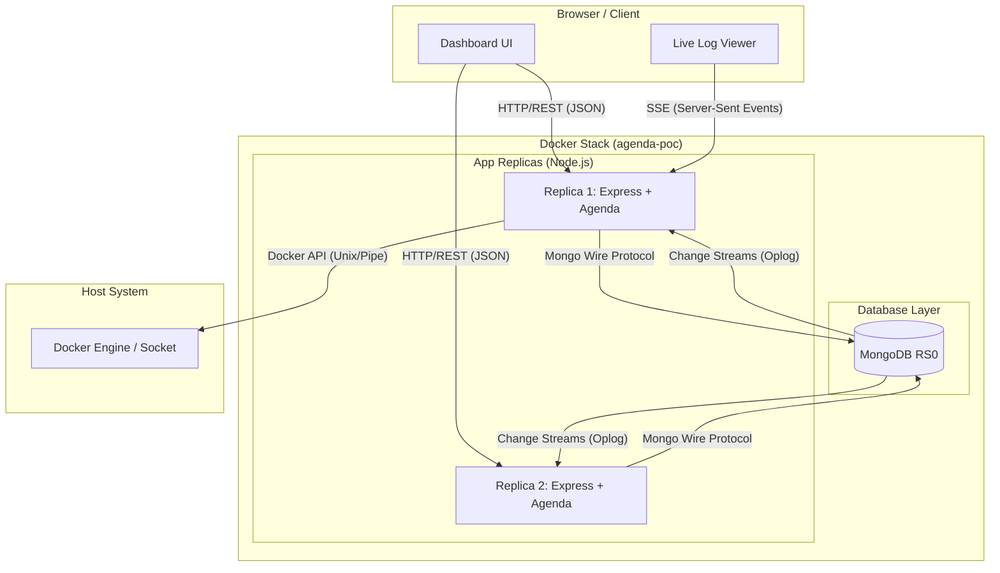

# Agenda User Demand Schedule POC

> [!CAUTION]
> **DISCLAIMER**: This project is heavily "vibe coded" and may contain bugs. It is strictly a **Proof of Concept (POC)** and is **NOT production-ready**. Use it only for demonstration or educational purposes.

This project is a Proof of Concept (POC) demonstrating how to schedule and manage user-specific tasks dynamically using an Express-based API and [Agenda.js](https://github.com/agenda/agenda). It leverages MongoDB Change Streams (via a replica set) for real-time job notifications, moving away from polling-based execution to an event-driven approach.

## Prerequisites

Ensure you have the following installed on your machine:
- [Node.js](https://nodejs.org/) (v24 or higher recommended)
- [npm](https://www.npmjs.com/) (usually comes with Node.js)
- [Docker](https://www.docker.com/) and [Docker Compose](https://docs.docker.com/compose/)

## Development: Database Only Mode

If you are developing the API locally on your host machine but want the MongoDB Replica Set to run in Docker:

```bash
docker compose up mongodb mongo-init -d
```

This will start the database and the initialization script, but **not** the 2 API replicas.

## Running the Full Stack (Recommended)

This project is configured to run with 2 replicas of the application service and a MongoDB replica set using Docker Compose.

1. **Build and start all services:**

   ```bash
   docker compose up --build -d
   ```

2. **Access the application:**
   - Since we are running 2 replicas, Docker Compose maps them to a port range `3000-3001`.
   - **Replica 1**: [http://localhost:3000](http://localhost:3000)
   - **Replica 2**: [http://localhost:3001](http://localhost:3001)

3. **Check status:**

   ```bash
   docker compose ps
   ```

4. **View logs:**

   ```bash
   docker compose logs -f agenda-poc
   ```

## Running Locally (Development)

If you prefer to run the application on your host machine while using Docker for MongoDB:

1. **Start only MongoDB:**

   ```bash
   docker compose up mongodb mongo-init -d
   ```

2. **Install dependencies:**

   ```bash
   npm install
   ```

3. **Run the development server:**

   ```bash
   npm run dev
   ```

The application will automatically connect to `mongodb://127.0.0.1:27017` by default.

## API Documentation

The project includes an interactive Swagger UI to explore and test the API. Once the server is running, you can access it at:

[http://localhost:3000/api-docs](http://localhost:3000/api-docs)

### Available Endpoints

- **POST `/jobs`**: Create a new recurring job for a specific user.
  - Body: `{ "jobName": "Task A", "username": "John", "userprompt": "Check logs", "schedule": "5 minutes" }`
- **GET `/jobs`**: List all jobs associated with a specific username.
  - Query Param: `?username=John`
- **DELETE `/jobs`**: Remove all jobs associated with a specific username.
  - Query Param: `?username=John`

### Management & Monitoring

- **Web UI**: A simple interface to manage jobs.
  - URL: [http://localhost:3000](http://localhost:3000)
- **Agendash**: Real-time dashboard to monitor jobs.
  - URL: [http://localhost:3000/dash](http://localhost:3000/dash)
- **Swagger API Docs**: Interactive API documentation.
  - URL: [http://localhost:3000/api-docs](http://localhost:3000/api-docs)

## Project Structure

```text
agenda-user-demand-schedule-poc/
├── src/
│   ├── config/         # Centralized configuration (Mongo URI, Port)
│   ├── jobs/           # Agenda job definitions & registration
│   ├── routes/         # Express API route modules
│   ├── index.ts        # Application bootstrap entry point
│   └── swagger.ts      # Swagger/OpenAPI documentation definitions
├── Dockerfile          # Node 24 based container definition
├── docker-compose.yaml # Full stack: MongoDB RS + 2x App Replicas
├── package.json        # Dependencies and scripts
└── tsconfig.json       # TypeScript configuration
```

## Key Features

- **Scalability**: Runs with multiple replicas to demonstrate distributed task processing.
- **Real-time Notifications**: Uses `MongoChangeStreamNotificationChannel` to respond to job events immediately using MongoDB Change Streams.
- **Dynamic Scheduling**: Allows creating jobs on-the-fly with human-readable intervals.
- **Persistence**: Jobs are stored in MongoDB and survive application restarts.
- **User Isolation**: Endpoints manage jobs based on a `username` attribute.

## System Architecture

The following diagram illustrates the distributed nature of the POC, showing how multiple replicas interact with a shared MongoDB Replica Set and the host's Docker Engine.



### Protocol Breakdown

1.  **HTTP/REST (JSON)**: Used by the Dashboard and external clients to create, list, and delete jobs.
2.  **MongoDB Wire Protocol**: Standard communication between the Node.js instances and the MongoDB cluster.
3.  **MongoDB Change Streams (Oplog)**: **Critical for POC.** When a job is added to MongoDB, the Change Stream notifies all active Agenda replicas instantly. This replaces polling and ensures real-time job execution.
4.  **Server-Sent Events (SSE)**: Used for the **Live Log Streamer**. It provides a lightweight, unidirectional stream from the backend to the browser to push real-time logs without the overhead of WebSockets.
5.  **Docker Engine API**: The backend communicates with the host's `/var/run/docker.sock` (or `//./pipe/docker_engine` on Windows) to fetch and multiplex logs from all containers in the stack.

## Live Distributed Logging (Demo Feature)

This project includes a built-in **Live Log Streamer** that allows you to see real-time logs from all running API replicas directly in your browser.

- **URL**: [http://localhost:3000/logs.html](http://localhost:3000/logs.html)

> [!CAUTION]
> ### Security Warning
> To enable this feature, the application mounts the **Docker Socket** (`/var/run/docker.sock`). 
> - **Risk**: This gives the container full control over the Docker host.
> - **Demo Purpose Only**: This was added strictly for "fun" and to easily demonstrate job distribution across multiple containers in a single view.
> - **Production**: **NEVER** mount the Docker socket in a production environment without proper security layers. 

To use this feature, ensure you run the full stack via `docker compose` so the socket can be mounted correctly.
